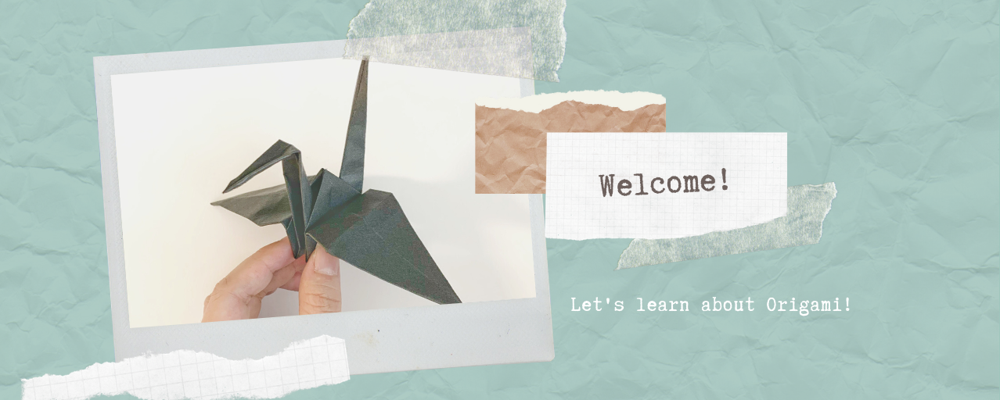

## Welcome to our OrigamiLearning project!

### About Us
Origami Learning was started as a group project to bring younger generations fun origami pieces they could create at school or in their home.
Our mission at is to utilize technology by providing teachers the tools necessary to continue teaching the youth about origami, from its origins to projects they can do.

### OrigamiLearning.com
We provide several origami instructions on our website, categorized in [easy](https://origamilearning.com/tutorials.html#tutorials), [medium](https://origamilearning.com/tutorials.html#redirect_medium), and [hard](https://origamilearning.com/tutorials.html#redirect_hard). Some instructions also include tutorial videos.
If you'd like to provide some feedback, don't hesitate to contact us through the [Contact Us](https://origamilearning.com/contact.html) page!

### Website Preview
[Image](image/index.PNG)